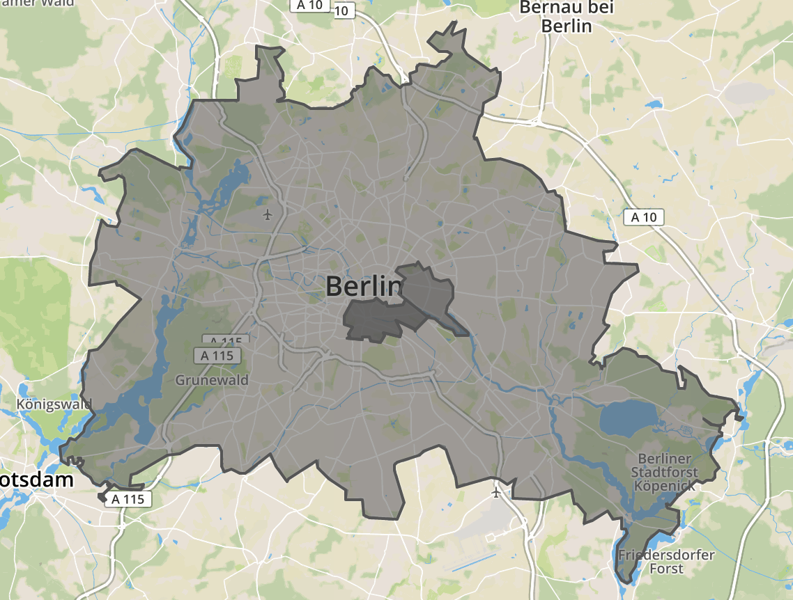

# rs-geo-playground



## Prepare

Download OSM bundle.

```bash
curl https://download.geofabrik.de/europe/germany/berlin-latest.osm.pbf -o berlin-latest.osm.pbf
```

Extract administrative boundaries from OSM to speed up processing.

```bash
brew install osmium-tool
osmium tags-filter berlin-latest.osm.pbf \
  r/boundary=administrative \
  -o berlin-boundaries.pbf
```

## Build

```bash
cargo build --release
```

## Create RTree

```bash
./target/release/build-rtree --bin rtree.bin --pbf berlin-boundaries.pbf
```

## Locate point

List boundaries.

```bash
./target/release/locate -b rtree.bin -l 13.4,52.5
boundary: Berlin, level: 4
boundary: Kreuzberg, level: 10
boundary: Friedrichshain-Kreuzberg, level: 9
```

Compile geojson file with boundaries.

```bash
./target/release/locate -b rtree.bin -l 13.4,52.5 -g boundaries.geojson
cat boundaries.geojson | pbcopy
# paste in geojson.io or similar
```

## Benchmark

```bash
./target/release/bench -l 13.4303813,52.528289 -b rtree.bin
rtree:  32us 427ns (R²=1.000, 32975 iterations in 84 samples)
flat:  177us 339ns (R²=0.999, 5919 iterations in 66 samples)
```

